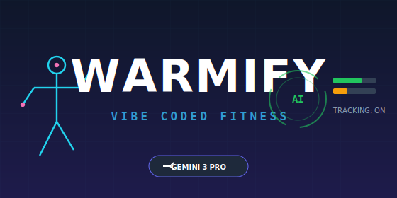
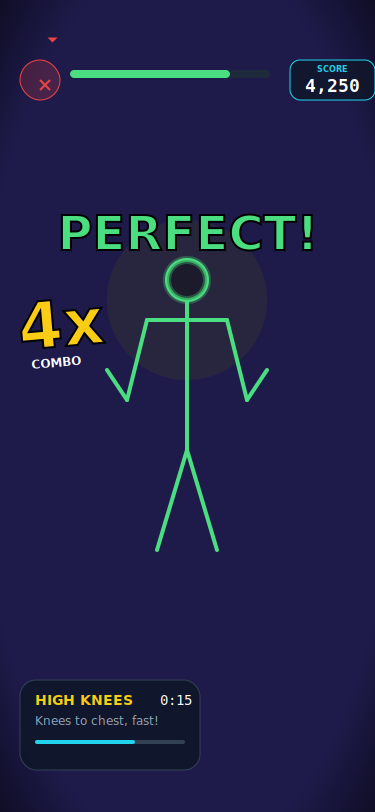
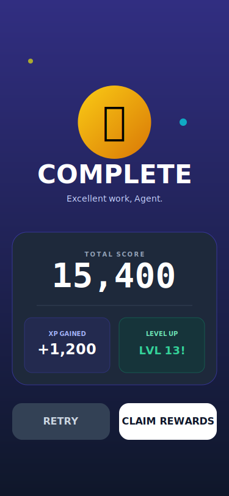
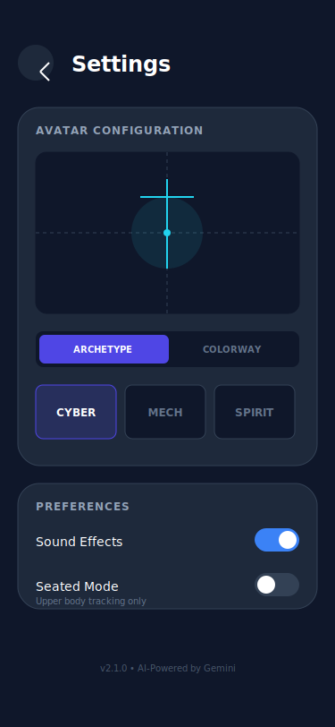

# Warmify - AI-Powered Gamified Fitness Coach 🦁



> **Submission for Google DeepMind - Vibe Code with Gemini 3 Pro**  
> *Turning fitness into an immersive RPG using Multimodal AI.*

## 🚀 Summary

**Warmify** is a futuristic, AI-powered Progressive Web App (PWA) that transforms your daily workout into an immersive Rhythm RPG. Built entirely using **Google AI Studio's Vibe Coding** workflow with Gemini 3 Pro, it solves the two biggest problems in home fitness: boredom and lack of professional feedback.

---

## 📸 Gallery

| Dashboard | Workout Mode |
|-----------|--------------|
|  |  |

| Results & Rewards | Customization |
|-------------------|---------------|
|  |  |

---

## 🎥 Demo & Links

- **[🔴 Live App Link (Google AI Studio)](https://ai.studio/apps/drive/1T7PuVGZq9Kz2yh-5b1dVVc8H2t-wHmKR)**
- **[📺 Video Demo (YouTube)](https://www.youtube.com/watch?v=TfxhVNkPQmY)**
- **[📄 Kaggle Writeup](https://www.kaggle.com/competitions/gemini-3/writeups/warmify)**

---

## 📱 App Store & Play Store Configuration

### Bundle ID
- **ID:** `com.odel.warmify`

### Subscription Plan
The app uses a single annual subscription model.

- **Product ID:** `warmify_annually`
- **Price:** $59.99 / year
- **Billing Period:** 1 Year

---

## 🔴 The Problem

Working out at home is difficult. Without a trainer, users struggle with **form** ("Am I squatting low enough?") and **motivation** ("This is boring"). Personal trainers are expensive, and existing apps are just passive video players that don't know if you are actually doing the work.

## 💡 The Solution

Warmify turns your webcam into a sensor for a digital game using Multimodal AI.

1.  **See:** Using **MediaPipe**, it tracks 33 skeletal landmarks in real-time directly on your device (Privacy First).
2.  **Think:** **Gemini 3 Pro** acts as the Game Engine and Referee. It analyzes your movement quality, speed, and rhythm in real-time.
3.  **React:** Perform a "Perfect" rep, and your digital avatar glows neon green while you earn XP and Combos. Slouch or stop, and the system alerts you visually and audibly to correct your form.

---

## 🛠️ Tech Stack & Vibe Coding Journey

This project demonstrates the power of Gemini 3 Pro's "Vibe Coding". Instead of writing boilerplate manually, I prompted the vibe: 

> *'Create a leveling system where users unlock new neon skins for their skeleton avatar based on XP'* 
>
> *'Design a Three.js background that reacts to workout intensity'*

Gemini generated the complex logic for the `LevelingSystem`, `RigOverlay`, and `GameLoop`, allowing for a polished, high-fidelity prototype in record time.

*   **Frontend:** React 19, TailwindCSS, Lucide React.
*   **AI & Logic:** 
    *   **Google GenAI SDK:** Utilizing the Multimodal Live API for real-time interaction context.
    *   **MediaPipe Pose:** Client-side skeletal tracking for privacy-first performance.
*   **Visuals:** 
    *   **Three.js:** Procedurally generated background environments that react to workout intensity.
    *   **Canvas API:** Drawing the "Rig Overlay" (Cyber, Mech, Spirit avatars) over the user's video feed.
*   **Deployment:** Capacitor (iOS/Android) & PWA.

---

## 🎮 Key Features

*   **Multimodal Coaching:** Real-time form correction using computer vision + GenAI logic.
*   **Gamification:** Level up from "Rookie" to "Legend", unlock badges, and customize your skeletal avatar (Cyber, Mech, Spirit).
*   **Immersive Tech:** Three.js reactive backgrounds and a custom Web Audio API synthesizer for dynamic SFX.
*   **Accessible:** Runs entirely in the browser (iOS/Android/Desktop) with no installation required.

---

## 🏆 Impact

Warmify makes elite personal training free, fun, and accessible to anyone with a camera, lowering the barrier to a healthy lifestyle through the power of AI.

---

## 📦 Installation (Local Dev)

While the app is designed to be Vibe Coded in AI Studio, you can run it locally:

```bash
# Clone the repository
git clone https://github.com/oguzdelioglu/warmify.git

# Install dependencies
npm install

# Set up API Key
export API_KEY="your_gemini_api_key"

# Run the development server
npm run dev
```

## ☁️ Supabase Configuration (Leaderboard)

To enable the global leaderboard feature, you need to set up a free Supabase project:

1.  **Create Project:** Go to [Supabase](https://supabase.com) and create a new project.
2.  **Get Keys:** In Project Settings -> API, copy the `Project URL` and `anon public key`.
3.  **Env Setup:** Add them to your `.env` file:
    ```env
    VITE_SUPABASE_URL=your_project_url
    VITE_SUPABASE_ANON_KEY=your_anon_key
    ```
4.  **Create Setup:** Run the following SQL in the Supabase SQL Editor to create the leaderboard table and policies:

    ```sql
    create table leaderboard (
      id text primary key,
      username text,
      points bigint,
      level int,
      avatar text,
      updated_at timestamp default now()
    );

    -- Enable security policies
    alter table leaderboard enable row level security;
    create policy "Public read" on leaderboard for select using (true);
    create policy "Public insert/update" on leaderboard for insert with check (true);
    create policy "Public update" on leaderboard for update using (true);
    ```

*Built with ❤️ and ☕ using Google AI Studio.*